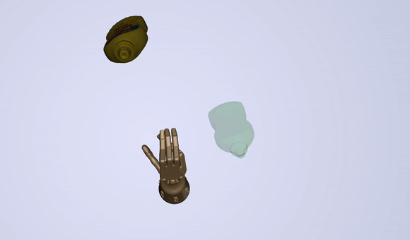

# DexMV: Imitation Learning for Dexterous Manipulation from Human Videos

## Changes made by Yogee-s

# Setting up of Environment

## Mujoco and Mujoco-py Installation Instructions 
The steps are taken from this [link](https://gist.github.com/saratrajput/60b1310fe9d9df664f9983b38b50d5da). (Make sure Mujoco is of version 2.0)

### Steps
```bash
# Create a new environment named dexmv
conda create --name dexmv python=3.8
conda activate dexmv
```

1. Install the Mujoco library.

    * Download the Mujoco library from this [link](https://www.roboti.us/download/mujoco200_linux.zip).
    * Create a hidden folder :
    ```bash
    mkdir /home/username/.mujoco
    ```
    * Extract the library to the .mujoco folder.
    ```bash
      # Extract the mujoco200_linux.zip into the .mujoco directory
      unzip mujoco200_linux.zip -d ~/.mujoco

      # Rename the extracted folder to mujoco200
      mv ~/.mujoco/mujoco200-linux-x86_64 ~/.mujoco/mujoco200
    ```
    * Download the activation key from this [link](https://www.roboti.us/license.html) and place it in the .mujoco/mujoco200/bin

    * Include these lines in .bashrc file.
    ```bash
      # Replace user-name with your username
      export MUJOCO_PY_MUJOCO_PATH=/home/user-name/.mujoco/mujoco200
      export MUJOCO_PY_MJKEY_PATH=/home/user-name/.mujoco/mujoco200/bin/mjkey.txt

      export LD_LIBRARY_PATH=/home/user-name/.mujoco/mujoco200/bin 
      export LD_LIBRARY_PATH=$LD_LIBRARY_PATH:/usr/lib/nvidia 
      export PATH="$LD_LIBRARY_PATH:$PATH" 
      export LD_PRELOAD=/usr/lib/x86_64-linux-gnu/libGLEW.so
    ```
    * Source bashrc.
    ```bash
    source ~/.bashrc
    ```
    * Test that the library is installed.
    ```bash
    cd ~/.mujoco/mujoco200/bin
    ./simulate ../model/humanoid.xml
    ```

2. Download mujoco-py.

      *Download mujoco-py-2.0.2.0 from this [link](https://github.com/openai/mujoco-py/releases)
      
    ```bash
      # Extract the mujoco-py-2.0.2.0.tar.gz into the .mujoco directory
      tar -xvf mujoco-py-2.0.2.0.tar.gz -C ~/.mujoco/

      # Rename the extracted folder to mujoco-py
      mv ~/.mujoco/mujoco-py-2.0.2.0. ~/.mujoco/mujoco-py
    ```

4. Install mujoco-py.
      ```bash
      conda activate dexmv
      sudo apt update
      sudo apt-get install patchelf
      sudo apt-get install python3-dev build-essential libssl-dev libffi-dev libxml2-dev  
      #For ubuntu 20.04
      sudo apt-get install libxslt1-dev zlib1g-dev libglew1.5 libglew-dev python3-pip
      #For ubuntu 22.04 
      sudo apt-get install libxslt1-dev zlib1g-dev libglew-dev python3-pip


      # Clone mujoco-py.
      cd ~/.mujoco
      git clone https://github.com/openai/mujoco-py
      cd mujoco-py
      pip install -r requirements.txt
      pip install -r requirements.dev.txt
      pip3 install -e . --no-cache
      ```
5. Reboot your machine.
      ```bash
      sudo reboot
      ```
6. After reboot, run these commands to install additional packages.
      ```bash
      conda activate dexmv
      sudo apt install libosmesa6-dev libgl1-mesa-glx libglfw3
      sudo ln -s /usr/lib/x86_64-linux-gnu/libGL.so.1 /usr/lib/x86_64-linux-gnu/libGL.so
      # If you get an error like: "ln: failed to create symbolic link '/usr/lib/x86_64-linux-gnu/libGL.so': File exists", it's okay to proceed
      pip3 install -U 'mujoco-py==2.0.2.0'

      #if there is compile errors, try installing this
      pip install "cython<3"      
      pip install lockfile
      #if gcc error
      conda install -c conda-forge gcc=12.1.0
      ```
7. Check if mujoco-py is properly installed.
      ```bash
      cd ~/.mujoco/mujoco-py/examples
      python3 markers_demo.py
      ```
# Changes made to DexMV & DexMV-Learn
### Files added
- test_ipynb
- test_visualise_debug.py
- train_visualise_debug.py
- handright9253.xml

### Scripts modified
#### DexMv-Sim
- `YCBRelocate` : 

- `examples/visualize_policy.py` : 

- `examples/train.py` :
#### DexMv-Learn
- `dexmv-learn/mjrl/mjrl/algos/dapg.py`
- `dexmv-learn/mjrl/mjrl/algos/behaviour_cloning.py`
- `dexmv-learn/mjrl/mjrl/policies/gaussian_mlp.py`


<hr/>

[[Project Page]](https://yzqin.github.io/dexmv/) [[Paper]](https://arxiv.org/abs/2108.05877) [[Demonstration Files]](https://drive.google.com/file/d/1v-SezFDQBcgekHZBlqulqa8rIgn0iwRT/view?usp=sharing)[[Raw Data(subset)]](https://drive.google.com/file/d/1k9dqlUyr_iL9bBp0WpK8fKK4DToWl_AC/view?usp=sharing)
-----

[DexMV: Imitation Learning for Dexterous Manipulation from Human Videos](https://yzqin.github.io/dexmv/), Yuzhe Qin*,
Yueh-Hua Wu*, Shaowei Liu, Hanwen Jiang, Ruihan Yang, Yang Fu, Xiaolong Wang, ECCV 2022.

DexMV is a novel system and pipeline for learning dexterous manipulation from human demonstration videos.
This repo contains the **simulated environment** and **retargeting** code for DexMV.
The learning part for DexMV is maintained
in [dexmv-learn](https://github.com/yzqin/dexmv-learn).

Pretrained model are provided to try our environment without training. Demonstrations generated by DexMV pipeline are
also provided if you want to try from scratch.


## Bibtex

```
@misc{qin2021dexmv,
      title={DexMV: Imitation Learning for Dexterous Manipulation
      from Human Videos},
      author={Qin, Yuzhe and Wu, Yueh-Hua and Liu, Shaowei and Jiang, Hanwen, 
      and Yang, Ruihan and Fu, Yang and Wang, Xiaolong},
      year={2021},
      archivePrefix={arXiv},
      primaryClass={cs.LG}
      }
```

## Installation

1. Install the MuJoCo. It is recommended to use conda to manage python package:

Install MuJoCo from: http://www.mujoco.org/ and put your MuJoCo licence to your install directory. If you already have
MuJoCo on your computer, please skip this step. Note that we use MuJoCo 2.0 for our experiments.

2. Install Python dependencies Create a conda env with all the Python dependencies.

```bash
# Download the code from this repo for the simulated environment, retargeting and examples
git clone https://github.com/yzqin/dexmv-sim
export DEXMV_PACKAGE_PATH=`pwd`
cd dexmv-sim

# The provoided package version in the yml is our testing environment, you do not need to follow the version of each python package precisely to run this code.
conda env update -f environment.yml 
#pip install torch and yacs if needed
conda activate dexmv
pip install -e .

# Download the code from dexmv-learn repo for the RL/Imitation algorithm.
# dexmv-learn is necessary in order to test on pretrained model or train from scratch, either with RL or with imitation.
cd $DEXMV_PACKAGE_PATH
git clone https://github.com/yzqin/dexmv-learn
cd dexmv-learn
pip install -e .
cd mjrl
pip install -e .
```

3. The file structure is listed as follows:

`dexmv-sim/hand_imitation/`: environments, kinematics retargeting, and demonstration generation

`dexxmv-sim/hand_imitation/hand_imitation/kinematics`: kinematics retargeting and demonstration generation

`examples/`: example code to try DexMV

`dexmv-learn/`: training and inference for RL/Imitation learning algorithm

Additional docs other than this README: [Demonstration Generation](docs/demo_gen.md), [Environment](docs/env.md)

## Visualize Pretrained Policy

### Relocate

You may need to setup the MuJoCo related environment variables, e.g. `LD_LIBRARY_PATH` before running the code.

```bash
cd DEXMV_PACKAGE_PATH/examples
python visualize_policy.py --env_name=relocate --object_name=tomato_soup_can # for relocate task
```

You can also try different object_name: mug, sugar_box, large_clamp, mustard_bottle, potted_meat_can, foam_brick

If it does not work for you, please check the GitHub issues for more
discussion: https://github.com/openai/mujoco-py/issues/268

### Pour and Place Inside

```
python visualize_policy.py --env_name=pour # run this in the `example` directory
python visualize_policy.py --env_name=place_inside
```

### Troubleshooting

If you encounter the following error:

```bash
ERROR: GLEW initalization error: Missing GL version
```

This is an issue related to MuJoCo OpenGL renderer. A quick fix is modifying the dynamic library loading order by:

```bash
export LD_PRELOAD=/usr/lib/x86_64-linux-gnu/libGLEW.so
```

## Train from scratch

### Download processed demonstrations

First download the demonstrations from
the [Google Drive](https://drive.google.com/file/d/1v-SezFDQBcgekHZBlqulqa8rIgn0iwRT/view?usp=sharing) and place all
the `.pkl` file in the `dexmv-sim/demonstrations` directory.

### Training config

We use a config system to specify the training parameters, including task, object, imitation learning algorithm or RL
only. For convenience, we have provided several config files for you.

### Training

For example, if you want to train relocate mug task using DAPG with demonstrations:

```bash
# Download processed demonstrations first before training
python train.py --cfg configs/dapg-mug-example.yaml  # run this in the `example` directory
```

Similarly, there are several config files for other tasks and algorithms in the `example/configs` directory you can use
for training.

## Hand Motion Retargeting

In this repo, we provide an minimal example for retargeting the human hand to robot hand. The pose data of an example
trajectory are also provided here for convenience.

The following code takes the human hand pose estimation results and retargets it to robot joint position sequence. The
result sequence will be saved as `example_retargeting.pkl`

```bash
python retarget_human_hand.py --hand_dir=./retargeting_source/relocate_mustard_example_seq/hand_pose --output_file=example_retargeting.pkl
```

To visualize the retargeted robot trajectory along with the object, you can run the following:

```bash
python visualize_retargeting.py --retargeting_result=example_retargeting.p --object_dir=./retargeting_source/relocate_mustard_example_seq/object_pose
```

**Note:** Demonstration generation is more than hand motion retargeting. It also involves trajectory generation, time
alignment, inverse dynamics and hindsight, to match the state and action space defined by RL environment. Please check
the [demo_generation.md](docs/demo_gen.md)



## Environment

If you want to use our simulated environment for your own research, check the [env.md](docs/env.md)

## Demonstration Generation

For more details about demonstration generation, check the [demo_generation.md](docs/demo_gen.md)

## Acknowledge

Some file in this repository is modified based on the code
from [robosuite](https://github.com/ARISE-Initiative/robosuite), [soil](https://people.eecs.berkeley.edu/~ilija/soil/),
[dapg](https://github.com/aravindr93/hand_dapg) , [dm_control](https://github.com/deepmind/dm_control),
[py-min-jerk](https://github.com/dkebude/py-min-jerk). We gratefully thank the authors of these amazing projects.

We also thank for Jiashun Wang for insightful discussions for the connection between human and robot hand, and thanks
the DexPilot authors for their detailed explanation of their method.

