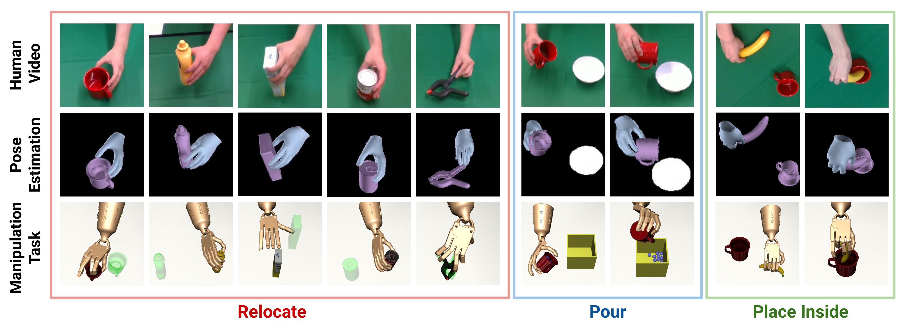

# DexMV: Imitation Learning for Dexterous Manipulation from Human Videos

## [[Project Page]](https://yzqin.github.io/dexmv/) [[Paper]](https://arxiv.org/abs/2108.05877) [[Demonstration Files]](https://drive.google.com/file/d/1v-SezFDQBcgekHZBlqulqa8rIgn0iwRT/view?usp=sharing)[[Raw Data(subset)]](https://drive.google.com/file/d/1k9dqlUyr_iL9bBp0WpK8fKK4DToWl_AC/view?usp=sharing)

[DexMV: Imitation Learning for Dexterous Manipulation from Human Videos](https://yzqin.github.io/dexmv/), Yuzhe Qin*,
Yueh-Hua Wu*, Shaowei Liu, Hanwen Jiang, Ruihan Yang, Yang Fu, Xiaolong Wang, ECCV 2022.

DexMV is a novel system and pipeline for learning dexterous manipulation from human demonstration videos.
This repo contains the **simulated environment** and **retargeting** code for DexMV.
The learning part for DexMV is maintained
in [dexmv-learn](https://github.com/yzqin/dexmv-learn).

Pretrained model are provided to try our environment without training. Demonstrations generated by DexMV pipeline are
also provided if you want to try from scratch.



## Bibtex

```
@misc{qin2021dexmv,
      title={DexMV: Imitation Learning for Dexterous Manipulation
      from Human Videos},
      author={Qin, Yuzhe and Wu, Yueh-Hua and Liu, Shaowei and Jiang, Hanwen,
      and Yang, Ruihan and Fu, Yang and Wang, Xiaolong},
      year={2021},
      archivePrefix={arXiv},
      primaryClass={cs.LG}
      }
```

## Changes made by Yogee-s

Original README is here if needed: [Original_README.md](docs/Original_README.md)

# Setting up of Environment

## Mujoco and Mujoco-py Installation Instructions

Follow the instructions here to install mujoco: [mujoco_README.md](docs/mujoco_README.md)

## DexMv-Sim and DexMv-Learn Installation Instructions

Install Python dependencies Create a conda env with all the Python dependencies.

```bash
# Download the code from this repo for the simulated environment, retargeting and examples
git clone https://github.com/yzqin/dexmv-sim
export DEXMV_PACKAGE_PATH=`pwd`
cd dexmv-sim

# The provoided package version in the yml is our testing environment, you do not need to follow the version of each python package precisely to run this code.
conda env update -f environment.yml
#pip install torch and yacs if needed
conda activate dexmv
pip install -e .

# Download the code from dexmv-learn repo for the RL/Imitation algorithm.
# dexmv-learn is necessary in order to test on pretrained model or train from scratch, either with RL or with imitation.
cd $DEXMV_PACKAGE_PATH
git clone https://github.com/yzqin/dexmv-learn
cd dexmv-learn
pip install -e .
cd mjrl
pip install -e .
```

# Changes made to DexMV & DexMV-Learn

### Files added

- `test.ipynb`: Jupyter notebook with useful commands
- `test_visualise_debug.py` : Debug script
- `train_visualise_debug.py` : Debug script
- `hand_imitation/env/models/assets/inspire`: Model file of Inspire hand (Converted URDF to Mujoco XML)

### Scripts modified

#### DexMv-Sim

- `YCBRelocate` : Modified number of actuators and alternate reward structures to be improved on.

- `examples/visualize_policy.py` : Modified paths to visualize trained models from different folders.

- `examples/train.py` : Integrated Tensorboard summary writer for live update of graphs. Refer to test.ipynb to see command.

- `examples/configs/dapg-mug-example.yaml` : Configured parameters for training.

#### DexMv-Learn

- `dexmv-learn/mjrl/mjrl/algos/dapg.py` : Integrated sampling of demonstration data for training
- `dexmv-learn/mjrl/mjrl/algos/behaviour_cloning.py`: Integrated sampling of demonstration data for training
- `dexmv-learn/mjrl/mjrl/policies/gaussian_mlp.py`: Integrated sampling of demonstration data for training

<hr/>

### The file structure is listed as follows:

`dexmv-sim/hand_imitation/`: environments, kinematics retargeting, and demonstration generation

`dexxmv-sim/hand_imitation/hand_imitation/kinematics`: kinematics retargeting and demonstration generation

`examples/`: example code to try DexMV

`dexmv-learn/`: training and inference for RL/Imitation learning algorithm

Additional docs other than this README: [Demonstration Generation](docs/demo_gen.md), [Environment](docs/env.md)

## Visualize Pretrained Policy

### Relocate

You may need to setup the MuJoCo related environment variables, e.g. `LD_LIBRARY_PATH` before running the code.

```bash
cd DEXMV_PACKAGE_PATH/examples
python visualize_policy.py --env_name=relocate --object_name=tomato_soup_can # for relocate task
```

You can also try different object_name: mug, sugar_box, large_clamp, mustard_bottle, potted_meat_can, foam_brick

If it does not work for you, please check the GitHub issues for more
discussion: https://github.com/openai/mujoco-py/issues/268

### Troubleshooting

If you encounter the following error:

```bash
ERROR: GLEW initalization error: Missing GL version
```

This is an issue related to MuJoCo OpenGL renderer. A quick fix is modifying the dynamic library loading order by:

```bash
export LD_PRELOAD=/usr/lib/x86_64-linux-gnu/libGLEW.so
```

## Train from scratch

### Download processed demonstrations

First download the demonstrations from
the [Google Drive](https://drive.google.com/file/d/1v-SezFDQBcgekHZBlqulqa8rIgn0iwRT/view?usp=sharing) and place all
the `.pkl` file in the `dexmv-sim/demonstrations` directory.

### Training config

We use a config system to specify the training parameters, including task, object, imitation learning algorithm or RL
only. For convenience, we have provided several config files for you.

### Training

For example, if you want to train relocate mug task using DAPG with demonstrations:

```bash
# Download processed demonstrations first before training
python train.py --cfg configs/dapg-mug-example.yaml  # run this in the `example` directory
```

Similarly, there are several config files for other tasks and algorithms in the `example/configs` directory you can use
for training.

## Environment

If you want to use our simulated environment for your own research, check the [env.md](docs/env.md)

## TODO in the future

- Work on training reallocation task for different objects (Start with mustard bottle)
  - Modify reward structure to penalise orientation of object
  - Work on making hand turn sideways before grabing
- Work on training model to complete pour and place inside tasks

## Acknowledge

Some file in this repository is modified based on the code
from [robosuite](https://github.com/ARISE-Initiative/robosuite), [soil](https://people.eecs.berkeley.edu/~ilija/soil/),
[dapg](https://github.com/aravindr93/hand_dapg) , [dm_control](https://github.com/deepmind/dm_control),
[py-min-jerk](https://github.com/dkebude/py-min-jerk). We gratefully thank the authors of these amazing projects.

We also thank for Jiashun Wang for insightful discussions for the connection between human and robot hand, and thanks
the DexPilot authors for their detailed explanation of their method.
